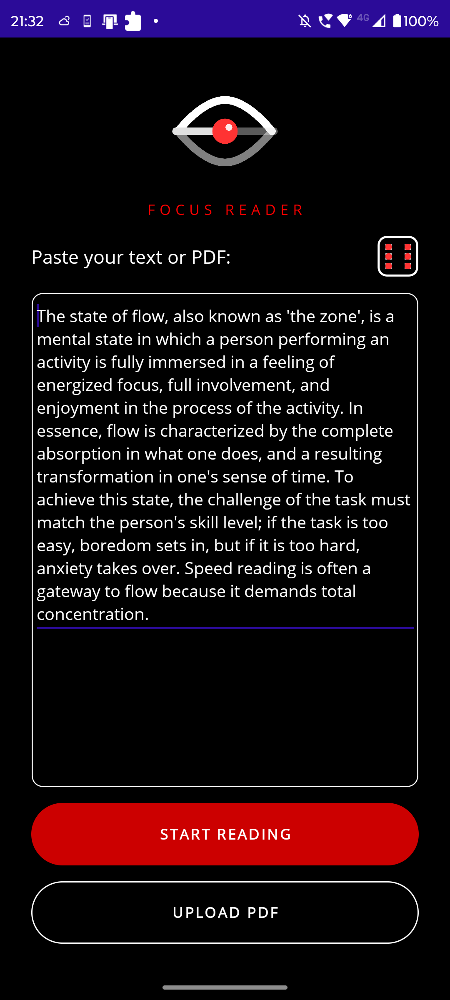
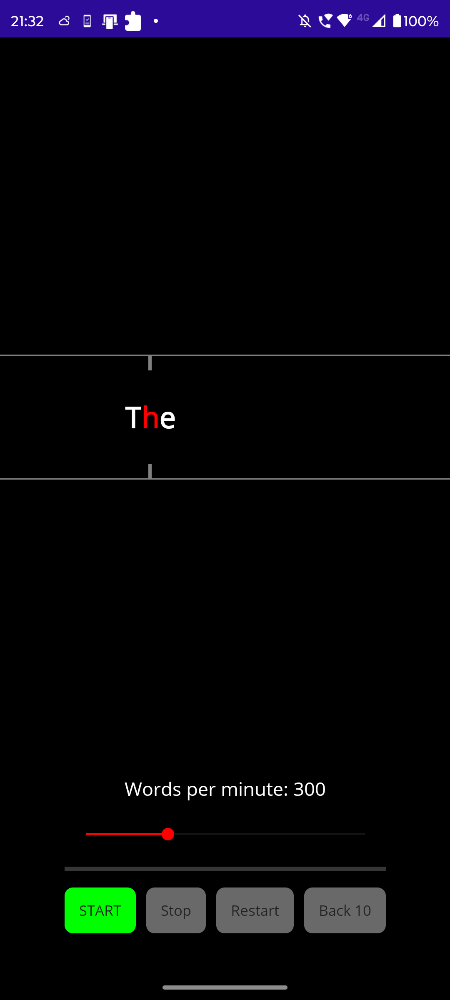
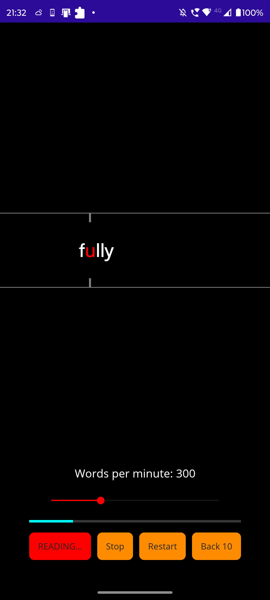

# 📚 Focus Reader

**Focus Reader** is a high-performance speed reading application developed to enhance cognitive processing using the **RSVP (Rapid Serial Visual Presentation)** methodology.

> ⚠️ **Note:** This project is a portfolio piece. The source code is proprietary and all rights are reserved.

---

## 📱 Interface Preview

  
  
  

---

## 🚀 Key Features

* **⚡ RSVP Engine:** Custom algorithm minimizing saccadic eye movements.
* **🎲 Gamified Learning:** Interactive 3D dice animation (using `RotateTo` & async tasks) generating educational content.
* **🧠 Cognitive Load Optimization:**
    * **Dark Mode UI:** High contrast layout (Black/Red/White) to reduce eye strain.
    * **Fixed Focus Point:** Optical Recognition Point (ORP) highlighted in red for stability.
* **📄 PDF Parsing:** Integrated `PdfPig` library for extracting text from external documents.
* **🔧 Adaptive Layout:** Responsive `Grid` system ensuring stability across different device aspect ratios.

## 🛠️ Technical Stack

* **Framework:** .NET MAUI (Multi-platform App UI) 8.0/9.0
* **Language:** C#
* **Architecture:** MVVM Pattern (Model-View-ViewModel) concepts
* **Async/Await:** Heavy usage for non-blocking UI during animations and file processing.

## 🔒 License

**Copyright © 2024 Furtună Denis-Andrei. All Rights Reserved.**
This code is for demonstration purposes only. Redistribution or modification is strictly prohibited.

---
*Created with passion by Furtună Denis-Andrei*
